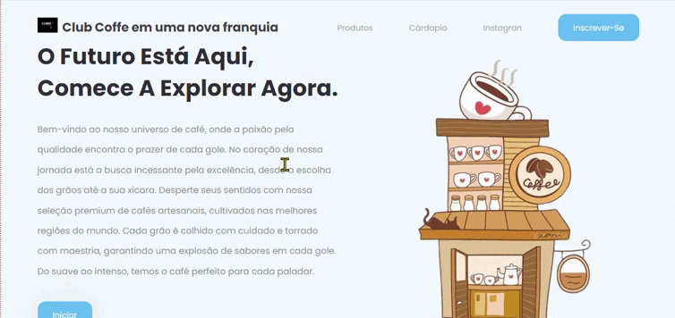

# Índice   
   - [Descrição](#descri%C3%A7%C3%A3o)
   - [Introdução](#introdu%C3%A7%C3%A3o)
   - [Funcionalidades](#funcionalidades%EF%B8%8F)
   - [Tecnologias Utilizadas](#tecnologias-utilizadas)
   - [Funcionando](#funcionando)
   - [Fontes Consultadas]()
   - [Autores]()

## DESCRIÇÃO📜
Desenvolvemos uma Landing Page exclusiva para a nova cafeteria na Saul Elkind, projetada para apresentar as promoções, produtos e serviços irresistíveis oferecidos por esse novo empreendimento. A página tem como foco proporcionar uma experiência envolvente aos potenciais consumidores da região, incentivando-os a explorar as ofertas exclusivas da cafeteria através do Instagram institucional.

## Introdução📖
A Landing Page foi concebida com o propósito de divulgar informações atrativas e relevantes sobre a cafeteria recém-inaugurada na Saul Elkind. Criamos um ambiente online que destaca não apenas as promoções especiais, mas também os produtos e serviços distintos que tornam essa cafeteria única na região.

## Funcionalidades⚙️

* Página Inicial Impactante:
Apresentação envolvente sobre a cafeteria, destacando sua atmosfera acolhedora e características distintivas.

* Promoções em Destaque:
Uma seção dinâmica dedicada a destacar as promoções atuais, projetada para atrair a atenção imediata dos visitantes.

* Produtos e Serviços em Evidência:
Uma seção visualmente atrativa para exibir os produtos e serviços exclusivos oferecidos pela cafeteria, incentivando os visitantes a explorarem mais.

* Navegação Intuitiva:
Links de navegação intuitivos que facilitam o acesso às diferentes seções da página, garantindo uma experiência fluida para os usuários.

* Call-to-Action Persuasiva:
Mensagens e elementos persuasivos incentivam os visitantes a conhecerem mais sobre os produtos e a participarem das promoções.

## Tecnologias Utilizadas🌐

</code>

<code></code>

<code></code>

<code></code>

<code></code>

## Funcionando

## Fontes Consultadas
 
[youtube](https://youtu.be/RaITAxEdTDY?si=SYE6ZOLW1EYN8arR)  

## Autores

[Nicolas Kaiki](https://github.com/NicolasMussi89)

